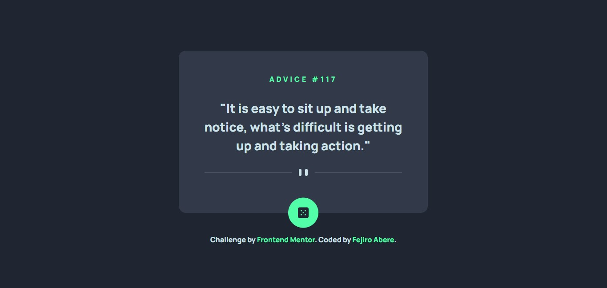
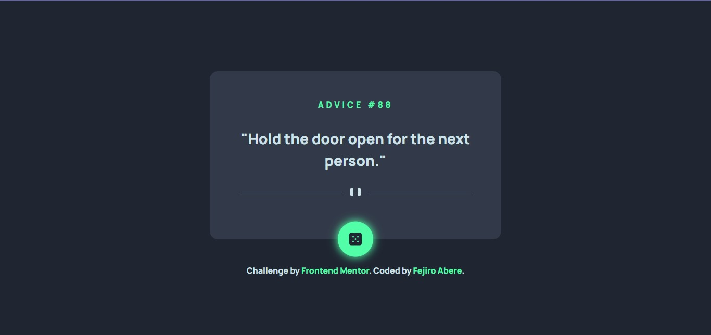

# Frontend Mentor - Advice generator app solution

This is a solution to the [Advice generator app challenge on Frontend Mentor](https://www.frontendmentor.io/challenges/advice-generator-app-QdUG-13db).

## Table of contents

- [Overview](#overview)
  - [The challenge](#the-challenge)
  - [Screenshot](#screenshot)
  - [Links](#links)
- [My process](#my-process)
  - [Built with](#built-with)
  - [What I learned](#what-i-learned)
  - [Continued development](#continued-development)
  - [Useful resources](#useful-resources)
- [Author](#author)

## Overview

### The challenge

Users should be able to:

- View the optimal layout for the app depending on their device's screen size
- See hover states for all interactive elements on the page
- Generate a new piece of advice by clicking the dice icon

### Screenshot

- Advice Generated


- Button Active/Hover State


### Links

- Solution URL: [Solution](https://www.frontendmentor.io/solutions/advice-generator-flexboxapi-pvHA6CThBq)
- Live Site URL: [Live Site](https://fejiro001.github.io/advice-generator-app-main/)

## My process

### Built with

- Semantic HTML5 markup
- CSS custom properties
- Flexbox
- CSS Grid
- Mobile-first workflow
- API

### What I learned

Learnt how to fetch API and render the data fetched in the HTML and perform animation on clicking a button.

```js
let apiURL = "https://api.adviceslip.com";

// Fetch the data from the API URL
async function fetchData() {
    let response = await fetch(`${apiURL}/advice`);
    let data = await response.json();
    displayAdvice(data);
}

// Displays the data in our website
function displayAdvice(data) {
    adviceNumber.textContent = data.slip.id;
    adviceText.textContent = '"' + data.slip.advice + '"';
}

// Changes to a new advice text and corresponding id number on clicking
adviceButton.addEventListener('click', () => {
    fetchData();

    // adds animation anytime the button is clicked
    setTimeout(() => {
        dice.classList.add("rollDice");
    }, 20);
    dice.classList.remove("rollDice");
});
```

### Continued development

I want to create more websites that fetch API and also learn best practices.

### Useful resources

- [Fetch](https://javascript.info/fetch) - Learnt how to fetch API
- [Fetch API](https://www.javascripttutorial.net/web-apis/javascript-fetch-api/) - Learnt how to fetch API

## Author

- Frontend Mentor - [@Fejiro001](https://www.frontendmentor.io/profile/Fejiro001)
- Twitter - [@aberefejiro](https://www.twitter.com/aberefejiro)
